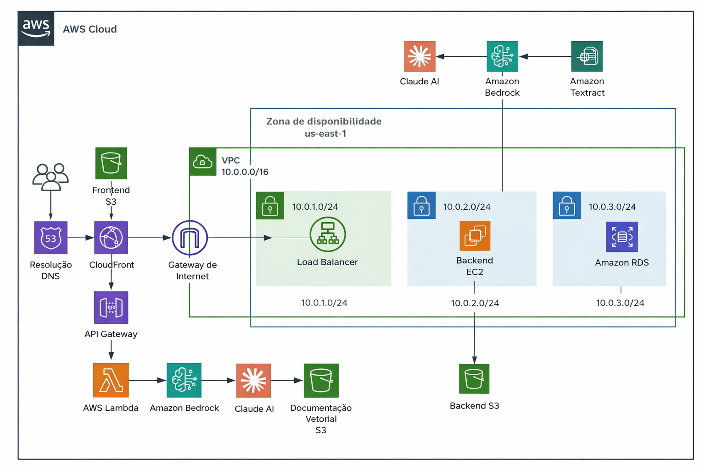

# Projeto de Estoque SSMAI

Bem-vindo ao **SSMAI Backend** 👋

Este repositório contém o backend do **Projeto de Estoque SSMAI**, uma solução voltada ao controle e à organização de informações de estoque, com apoio de inteligência artificial para tornar os processos mais eficientes e práticos.

A proposta do projeto inclui o uso de IA para **previsão de saída de produtos**, auxiliando na tomada de decisão e no planejamento de reposições, além da aplicação de **IA para facilitar a inclusão de itens no catálogo**, permitindo o cadastro de produtos de forma mais prática a partir de imagens, como a captura de fotos dos produtos.

O backend é responsável por centralizar as regras de negócio, o processamento de dados e a integração com serviços externos necessários para suportar essas funcionalidades.

O projeto está em constante evolução e pode receber melhorias e novas funcionalidades conforme as necessidades forem surgindo.

Sinta-se à vontade para explorar o repositório.

## Arquitetura

Abaixo está o diagrama de arquitetura do projeto:

